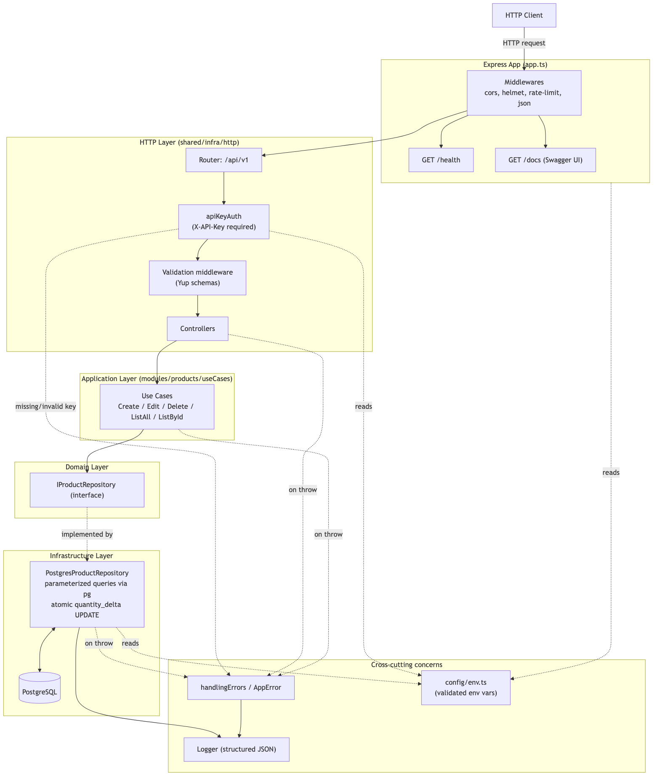
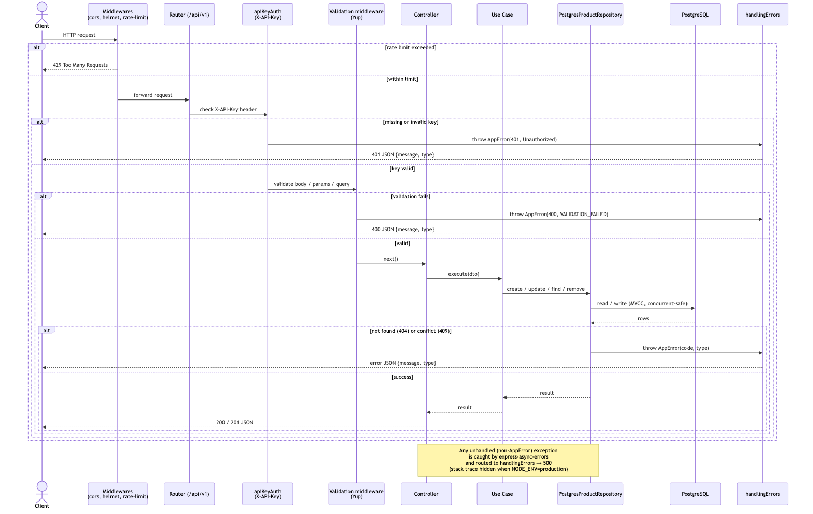
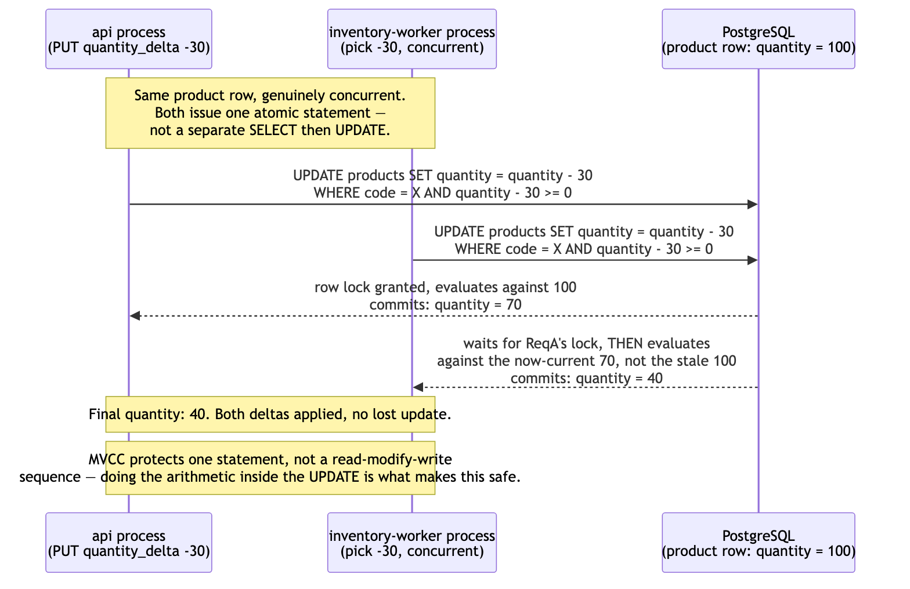
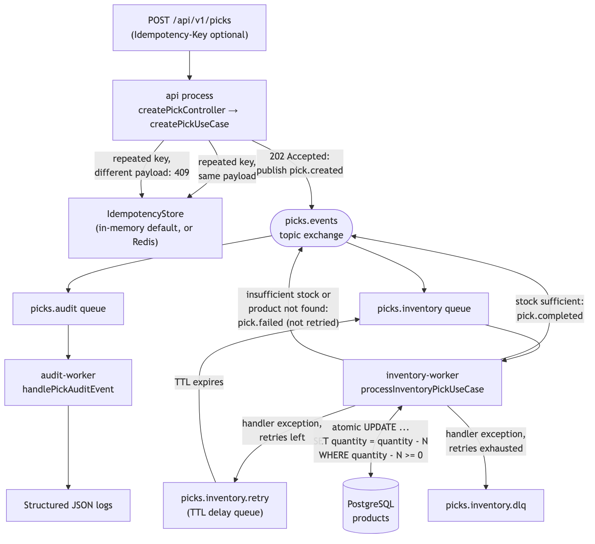
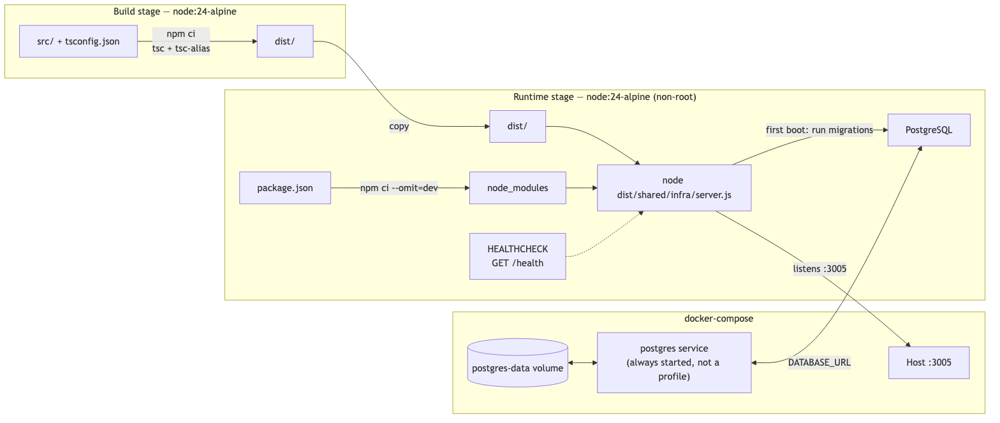

# System Flow

This document explains how a request moves through the system, how
concurrent writes to PostgreSQL are kept safe, and how the application is
built and deployed. Diagrams are generated from Mermaid sources — see
[Regenerating the diagrams](#regenerating-the-diagrams).

## 1. Architecture

The project follows Clean Architecture: HTTP concerns, business rules and
data access are separated into distinct layers that only depend inward
(controllers depend on use cases, use cases depend on a repository
_interface_, never on the concrete PostgreSQL implementation).



- **Express App** (`src/shared/infra/app.ts`) wires global middlewares
  (`cors`, `helmet`, rate limiting, JSON body parsing), the `/health` check,
  the Swagger UI at `/docs`, and mounts the `/api/v1` router.
- **HTTP layer** (`src/shared/infra/http`) validates input with Yup schemas
  before it ever reaches a controller, and dispatches to controllers.
- **Application layer** (`src/modules/products/useCases`) holds one use case per
  operation (create, update, delete, list, find) — plain business
  logic with no knowledge of Express or the storage engine.
- **Domain layer**: `IProductRepository` is the interface use cases depend on,
  which keeps them testable with an in-memory fake (see
  `src/tests/InMemoryProductRepository.ts`).
- **Infrastructure layer**: `PostgresProductRepository` implements that
  interface with parameterized queries via `pg` (see
  [§3](#3-concurrency-safe-writes)).
- **Cross-cutting**: `AppError` + `handlingErrors` centralize error
  responses, `logger` emits structured JSON logs, `config/env.ts`
  validates every environment variable once at startup, and `apiKeyAuth`
  gates every `/api/v1/*` request behind an `X-API-Key` header (see
  [§2](#2-request-lifecycle)).

## 2. Request lifecycle

A single request — happy path and the error paths it can take at each
step:



Key points:

- Requests are rate-limited before they reach any route (`/api/*`, 100
  requests per minute by default).
- `apiKeyAuth` runs next, inside the `/api/v1` router (not as a sibling
  middleware in `app.ts`) — a request with a missing or wrong `X-API-Key`
  header gets a `401` before validation or any business logic runs. It has
  to live inside that router, not before it: a throw from a middleware
  mounted _before_ a sub-router isn't caught by that sub-router's own
  `handlingErrors` — Express only routes an error to handlers within the
  scope actually entered.
- Validation runs _before_ the controller — a request with an invalid body,
  path parameter or query string never reaches business logic.
- Any error thrown anywhere in the chain (auth, validation, use case,
  repository) ends up in the same place: `handlingErrors`. `AppError`
  instances map to their declared status code; anything else becomes a
  `500` with the stack trace hidden when `NODE_ENV=production`.

## 3. Concurrency-safe writes

PostgreSQL is the storage engine behind `IProductRepository`: a real
client-server database with MVCC, reachable over the network by any number
of app instances, with genuinely concurrent (not just correctly
serialized) writers:



This is what makes the `api` + `inventory-worker` split in the `messaging`
profile safe **for a single atomic statement** — both processes hold their
own connection to the same Postgres database, and Postgres serializes
concurrent writes to the same row correctly.

### 3.1 What MVCC does _not_ protect: a read-then-write race in application code

MVCC alone doesn't protect a **read-then-write sequence** in application
code, only a single statement. If `quantity_delta` were implemented as
`findByID` → compute the new value in JavaScript → `update()` with that
absolute value, two concurrent requests on the same product could both
read the same starting quantity and the second write would silently
overwrite the first's result — each `findByID` correctly reads whatever
was last committed at the moment it runs, which is exactly what makes the
race possible.

The fix is doing the arithmetic inside the SQL statement itself, so the
database resolves the race instead of application code:

```sql
UPDATE products
SET quantity = quantity + $1, pick_location = COALESCE($2, pick_location)
WHERE product_code = $3 AND quantity + $1 >= 0
RETURNING product_code, quantity, pick_location
```

(`IProductRepository.applyQuantityDelta` — the absolute-`quantity` path
still uses a plain `update()`, where last-write-wins is the correct,
intended semantics rather than a race.) A zero-row result from this
statement is ambiguous by construction (product missing vs. the guard
rejecting a negative result), so a disambiguating `SELECT` runs only on
that unhappy path, never on the success path.

This is proven with a real-concurrency regression test in both
`postgresProductRepository.integration.spec.ts` and
`api.integration.spec.ts` — `Promise.all` firing 20+ genuinely
simultaneous requests at the same product over real Postgres connections,
asserting the exact expected final quantity. A mocked-repository unit
test cannot exercise this class of bug at all; only real concurrent
connections can.

## 4. Asynchronous picking

`POST /api/v1/picks` returns `202 Accepted` immediately and publishes a
`pick.created` event — the actual stock decrement happens out of band in a
separate `inventory-worker` process, reusing the same Docker image as `api`
with a different entrypoint (real fault isolation: a worker crash doesn't
take the API down).



Key points:

- **Idempotency**: an `Idempotency-Key` header is claimed atomically
  (`IIdempotencyStore.setIfAbsent`, storing the original request, not just
  its result) — `InMemoryIdempotencyStore` by default, or
  `RedisIdempotencyStore` (`SET ... NX EX`) when `REDIS_URL` is set, the
  only one that recognizes a repeated key across `api` replicas. A repeated
  key with the _same_ payload returns the cached `pickId`; a repeated key
  with a _different_ payload is rejected with `409 Conflict` instead of
  silently returning a result for a request that was never actually
  processed. The claim-then-publish order (not check-then-publish-then-set)
  is what closes the race two concurrent requests with the same key would
  otherwise hit.
- **Stock update**: `inventory-worker` applies the same atomic
  `quantity = quantity + delta` statement described in [§3](#3-concurrency-safe-writes),
  so a pick and a concurrent `PUT .../quantity_delta` on the same product
  can't lose an update to each other.
- **Insufficient stock or an unknown product is a normal outcome**
  (`pick.failed`, acknowledged), not a retry case — retries are reserved for
  transient handler exceptions.
- **Retry / DLQ**: a transient failure is republished to a TTL delay queue
  with a per-message `expiration` (exponential backoff with equal jitter —
  `PICK_RETRY_DELAY_MS * 2^attempt`, capped at `PICK_RETRY_MAX_DELAY_MS`) up
  to `PICK_RETRY_MAX` times, then dead-lettered for inspection via the
  RabbitMQ management UI — no plugins, the message just dead-letters back
  to the main exchange once its own TTL expires. Trade-off: RabbitMQ only
  checks a classic queue's head message for expiry, so a message can sit
  slightly past its own delay if an earlier, longer-delay message is still
  ahead of it in the same retry queue.
- **Broker unavailable**: if RabbitMQ can't be reached when publishing,
  `POST /api/v1/picks` returns `503 Service Unavailable` — a downstream
  dependency outage, not an application bug, so it gets a distinct status
  from a generic `500`.
- **Audit trail**: `audit-worker` consumes every lifecycle event
  (`pick.created`/`pick.completed`/`pick.failed`) and writes it to the same
  structured JSON logger the rest of the app uses — no new datastore for
  what's naturally an append-only event log.

See [Async picking](../README.md#-async-picking) in the README for the
Compose profile that runs this (`--profile messaging`) and
[Observability](../README.md#-observability) for how a request is traced
end-to-end (Prometheus, Jaeger, Loki/Grafana) across both the API and the
workers.

## 5. Build & deployment

The Docker image is a multi-stage build: TypeScript is compiled in a
throwaway build stage, and only the compiled output plus production
dependencies land in the final runtime image, which runs as a non-root user.



`docker-compose.yml` starts `postgres` alongside `api` (a named volume
persists its data across restarts) — PostgreSQL isn't optional, so it's
not behind a Compose profile — and the built-in `HEALTHCHECK` polls `GET
/health`. `inventory-worker` and `audit-worker` reuse the same image but
explicitly disable that inherited `HEALTHCHECK`: they don't serve HTTP, so
a check against `/health` would always fail and leave them permanently
marked `unhealthy` in `docker ps` despite consuming their queues correctly.

## Regenerating the diagrams

Diagram **sources** and **rendered images** are kept separate on purpose —
the source files are the thing to edit; everything in `docs/img/` is a
build artifact:

```bash
npm run docs:diagrams
```

This runs two independent steps:

- `docs/mmd/*.mmd` → `docs/img/*.png`, via
  [`@mermaid-js/mermaid-cli`](https://github.com/mermaid-js/mermaid-cli)
  (fetched on demand through `npx`, not installed as a project dependency).
- `docs/src/system-overview.html` (the hand-drawn SVG behind the
  README's [system overview](../README.md#picklist-api)) →
  `docs/img/system-overview.svg`, a plain extraction of the `<svg>` element
  (`scripts/generate-system-overview.sh`) — no rendering step, since GitHub
  displays SVG directly in Markdown.
